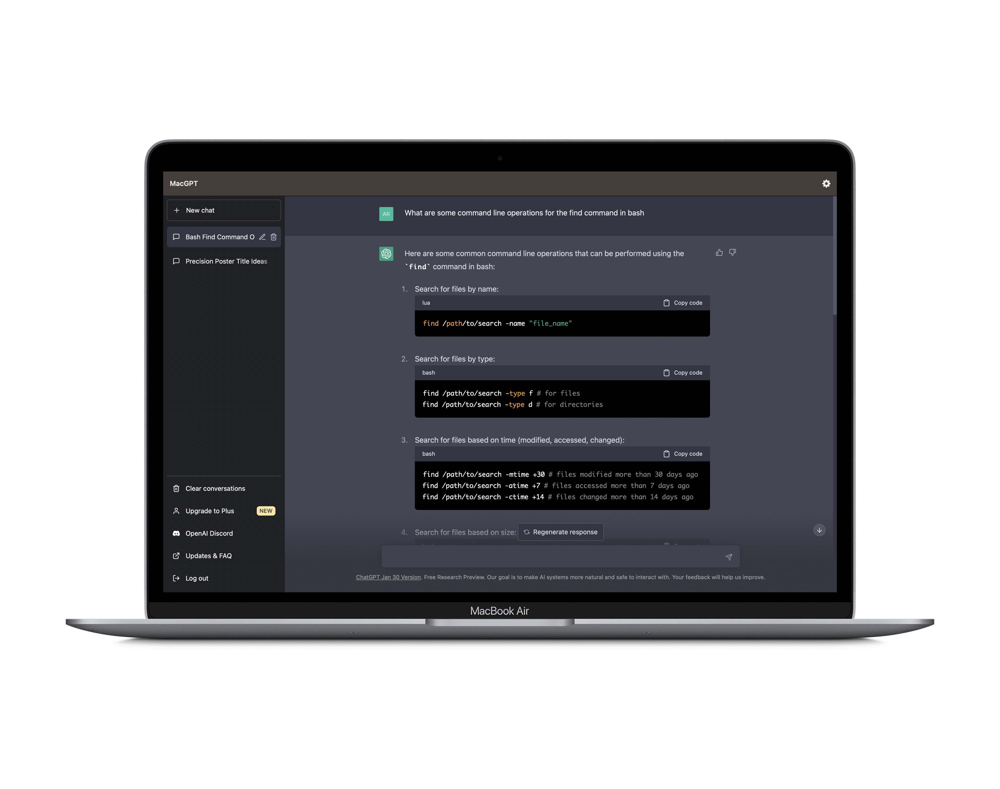
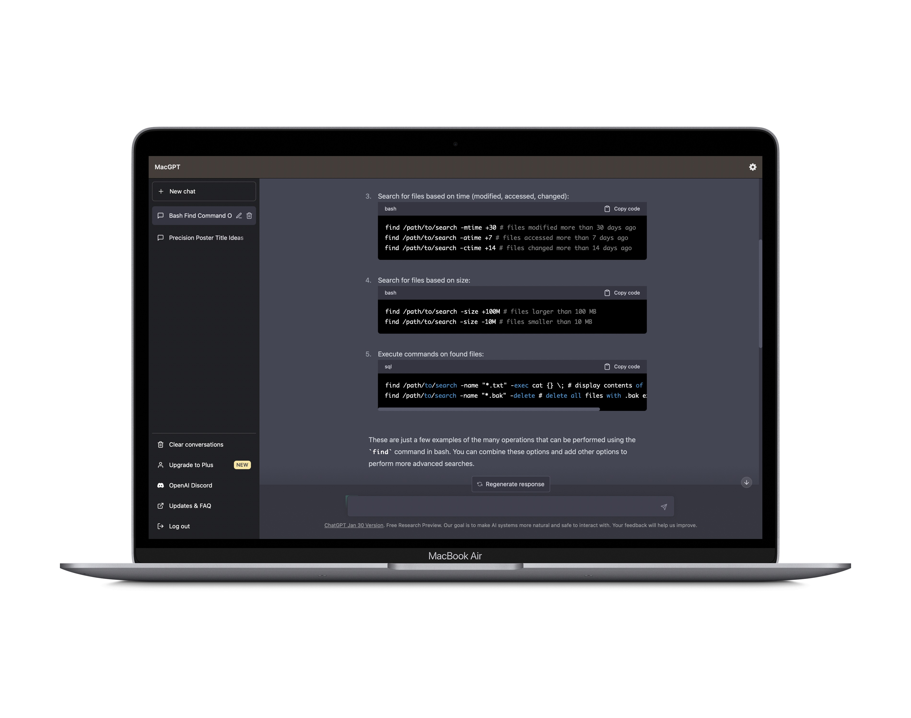

# RESEARCHING COMMANDS
In this lab report, I will be exploring command-line options for the `find` command. I will be using a cloned copy of the skill-demo1-data repository to demonstrate the commands.

### 1. SEARCHING FOR FILES BY TYPE:-
The `-type` modifier of the `find` command allows us to search for files within a directory by the type of file.

For example, `find * -type d` command prints all the individual directories within the repository.

This command can be really helpful when we do not have file explorer or finder to be able to navigate through the files and we do not know how many nested directories/folders there are.

Another example would be using `find * -type f` command prints all the files in all the directories of the skill-demo1-data repository.

This command can be helpful in situations when we are trying to determine the number of files in the entire repository. We did the same thing in lab. But we had to use the `find` command, followed by the `grep` command, which was then followed by the `wc` command. This was because the `find written_2/` command we used in lab not only printed out the files but also printed out the name of the folders, which gave us an inaccurate number of lines. Hence, we had to use `grep`. But if we observe closely, `find * -type f` command only prints out the files, thus solving the problem.

### 2. SEARCHING FOR FILES BASED ON TIME:-
The `-mtime` and `-atime` modifiers of the `find` command allow us to search for files withing a directory based on when the files were modified and/or accessed.

For example, `find * -mtime +2` command prints out the names of all the directories and files which were modified more than 2 days ago.

And the `find * -atime +3` command prints out the names of all the directories and files which were accessed more than 3 days ago.

These modifiers allow the `find` command to function as a very rudimentary version control system as it allows us to find out which files were accessed and modified when.

### 3. SEARCHING FOR FILES BASED ON SIZE:-
The `-size` modifier of the `find` command allows us to search for files based on their size.

For example, `find * -size +10M` prints out the names of the files which are larger than 10MB in size. The command doesn't print anything since there are no files which are larger than 10MB in this directory. Similarly, `find * -size +5M` and `find * -size +2M` also don't print anything.\
`find * -size -2M` prints out the names of all the files which are smaller than 2MB.

This modifier can be really helpful when we are working on servers with limited space. We can use the `-size ` modifier to keep track of the size of the files.

### 4. USING MULTIPLE MODIFIERS AT ONCE:-
Multiple modifiers for the `find` command can be used at once.

For example, `find written_2/non-fiction/OUP/Berk/*.txt -name "*.txt" -exec cat {} /;` command prints out the contents of all the `.txt` files which are at the path `skill-demo1-data/written_2/non-fiction/OUP/Berk/`

Instead of us having to use `find` and `cat` commands separately, this command allows us to execute both those commands at once, thus saving us time and making our process more efficient.

The `find written_2/non-fiction/OUP/Berk/ -name "*.txt" -delete` command deletes all the `.txt` files in the directory.

This command can be particularly useful for example if we need to delete all the `.class` files from a directory at once.

### RESEARCH FOR THIS LAB REPORT
For this lab report, I asked chatGPT to tell me about the modifiers of the `find` command. The screenshot of the chat is attached below:-

